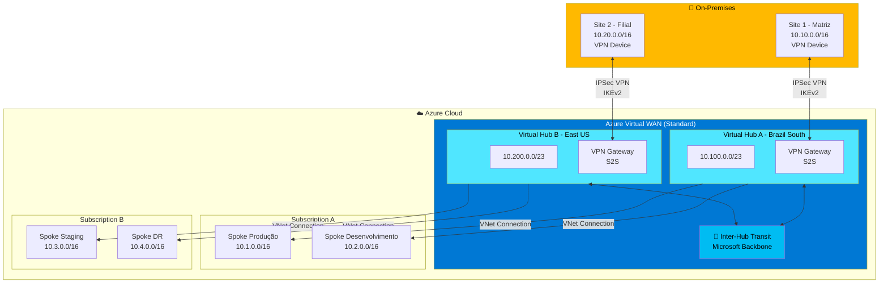
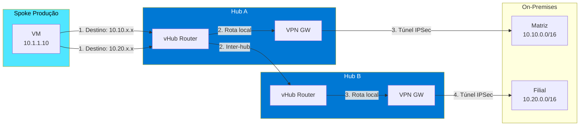
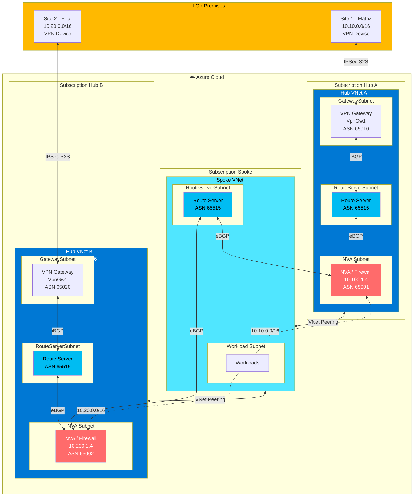
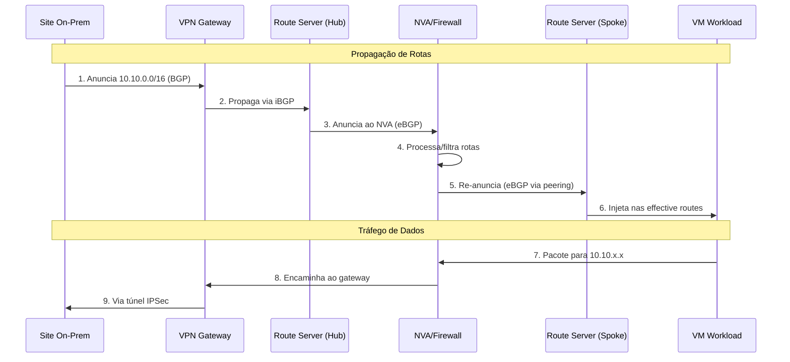
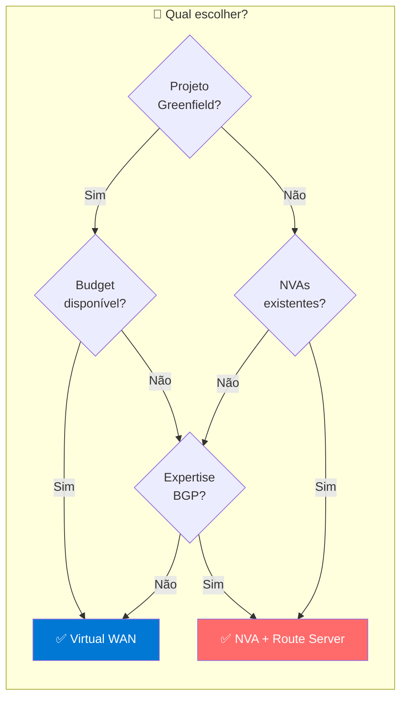

# Azure Multi-Hub Spoke com VPN Site-to-Site

## Cenário

Uma VNet **Spoke** precisa se conectar a **dois Hubs** em subscrições diferentes, cada um com seu próprio **VPN Gateway Site-to-Site**, e rotear o tráfego para o Hub correto conforme o destino on-premises.

### ⚠️ Limitação do VNet Peering Nativo

A opção **"Use Remote Gateways"** só pode ser habilitada em **um único peering por VNet**. Isso impede que uma Spoke use nativamente os VPN Gateways de dois Hubs simultaneamente via peering tradicional.

---

## Opção 1: Azure Virtual WAN com VPN Site-to-Site

### Visão Geral

O **Azure Virtual WAN** gerencia automaticamente a conectividade entre múltiplos hubs e sites VPN, com roteamento transitivo nativo entre todos os componentes.

### Diagrama de Arquitetura



### Fluxo de Tráfego Detalhado



### Componentes Necessários

| Componente | Função | Configuração |
|------------|--------|--------------|
| **Virtual WAN** | Recurso pai | Tipo: Standard |
| **Virtual Hub A** | Hub regional primário | Address: /23, Região: Brazil South |
| **Virtual Hub B** | Hub regional secundário | Address: /23, Região: East US |
| **VPN Gateway (Hub A)** | Terminação VPN Site 1 | Scale Units conforme throughput |
| **VPN Gateway (Hub B)** | Terminação VPN Site 2 | Scale Units conforme throughput |
| **VPN Sites** | Representação dos sites on-prem | IPs públicos, PSKs, address spaces |
| **VNet Connections** | Conexão das Spokes | Uma por Spoke VNet |

### Configuração via Portal Azure

#### Passo 1: Criar Virtual WAN

1. **Create a resource** → Buscar "Virtual WAN"
2. Preencher:
   - Resource Group: `rg-vwan-connectivity`
   - Name: `vwan-empresa`
   - Region: qualquer (recurso global)
   - Type: **Standard** ⚠️ *Basic não suporta multi-hub*

#### Passo 2: Criar Virtual Hubs

Para cada Hub (repetir para Hub A e Hub B):

1. Dentro do Virtual WAN → **Hubs** → **+ New Hub**
2. **Basics**:
   - Region: selecionar região desejada
   - Name: `vhub-brazilsouth` / `vhub-eastus`
   - Hub private address space: `10.100.0.0/23` / `10.200.0.0/23`
3. **Site to site**:
   - Do you want to create a Site to site (VPN gateway)? **Yes**
   - Gateway scale units: conforme necessidade
   - AS Number: deixar padrão (65515) ou customizar

#### Passo 3: Criar VPN Sites

1. Virtual WAN → **VPN sites** → **+ Create site**
2. Para cada site on-premises:

| Campo | Site 1 (Matriz) | Site 2 (Filial) |
|-------|-----------------|-----------------|
| Name | `site-matriz` | `site-filial` |
| Device vendor | Fabricante do equipamento | Fabricante |
| Private address space | `10.10.0.0/16` | `10.20.0.0/16` |
| Link name | `link-matriz` | `link-filial` |
| Link provider | ISP | ISP |
| Link IP address | IP público do VPN device | IP público |
| Link BGP address | Se usar BGP | Se usar BGP |
| Link ASN | Se usar BGP | Se usar BGP |

#### Passo 4: Conectar Sites aos Hubs

1. Virtual WAN → **Hubs** → Selecionar Hub → **VPN (Site to site)**
2. **+ Connect sites**
3. Selecionar o site correspondente
4. Configurar:
   - Pre-shared key (PSK): definir senha forte
   - Protocol: IKEv2 (recomendado)
   - IPsec: Default ou Custom
   - Connection Mode: Default
   - Propagate Default Route: conforme necessidade

#### Passo 5: Conectar Spoke VNets

1. Virtual WAN → **Virtual network connections** → **+ Add connection**
2. Para cada Spoke:

| Campo | Valor |
|-------|-------|
| Connection name | `conn-spoke-prod` |
| Hubs | Selecionar hub apropriado |
| Subscription | Pode ser diferente |
| Resource group | RG da Spoke |
| Virtual network | Selecionar a Spoke VNet |
| Propagate to none | No |
| Associate Route Table | Default |
| Propagate to Route Tables | Default |
| Propagate to labels | default |

#### Passo 6: Configurar Dispositivo VPN On-Premises

1. Virtual WAN → **VPN sites** → Selecionar site → **Download VPN configuration**
2. Arquivo JSON com:
   - IPs públicos do gateway Azure
   - Pre-shared keys
   - Parâmetros IPSec/IKE
3. Configurar o device on-premises conforme fabricante

### Tabela de Roteamento Resultante

Rotas na Spoke Produção (10.1.0.0/16):

| Prefixo | Next Hop | Origem |
|---------|----------|--------|
| 10.10.0.0/16 | vHub A VPN Gateway | Propagação automática |
| 10.20.0.0/16 | vHub A → vHub B | Inter-hub transit |
| 10.2.0.0/16 | vHub A | Peering |
| 10.3.0.0/16 | vHub A → vHub B | Inter-hub |
| 10.4.0.0/16 | vHub A → vHub B | Inter-hub |
| 10.100.0.0/23 | vHub A | Direct |
| 10.200.0.0/23 | vHub A → vHub B | Inter-hub |

### Vantagens

| ✅ | Descrição |
|----|-----------|
| Roteamento automático | Sem UDRs manuais |
| Multi-hub nativo | Full mesh automático |
| Simplicidade | Gestão centralizada |
| Escalabilidade | Scale units sob demanda |
| Any-to-any | Spokes, sites, tudo conectado |
| Download config | Facilita setup on-prem |

### Desvantagens

| ❌ | Descrição |
|----|-----------|
| Custo | Mais caro que tradicional |
| Flexibilidade | Customização limitada |
| Migração | Complexa se já existir infra |

---

## Opção 2: NVA com Azure Route Server (VPN S2S)

### Visão Geral

Arquitetura tradicional hub-spoke com **NVAs (Firewalls)** e **Azure Route Server** para injeção dinâmica de rotas via BGP. Cada Hub mantém seu VPN Gateway e o Route Server distribui as rotas para a Spoke.

### Diagrama de Arquitetura



### Fluxo de Propagação BGP



### Componentes e Subnets Necessárias

#### Hub VNet A (10.100.0.0/16)

| Subnet | CIDR | Componente |
|--------|------|------------|
| GatewaySubnet | 10.100.0.0/27 | VPN Gateway |
| RouteServerSubnet | 10.100.1.0/24 | Azure Route Server |
| NVA-Subnet | 10.100.2.0/24 | NVA/Firewall |
| Management | 10.100.3.0/24 | Jump boxes, etc |

#### Hub VNet B (10.200.0.0/16)

| Subnet | CIDR | Componente |
|--------|------|------------|
| GatewaySubnet | 10.200.0.0/27 | VPN Gateway |
| RouteServerSubnet | 10.200.1.0/24 | Azure Route Server |
| NVA-Subnet | 10.200.2.0/24 | NVA/Firewall |
| Management | 10.200.3.0/24 | Jump boxes, etc |

#### Spoke VNet (10.50.0.0/16)

| Subnet | CIDR | Componente |
|--------|------|------------|
| RouteServerSubnet | 10.50.0.0/24 | Azure Route Server |
| Workload-Subnet | 10.50.1.0/24 | VMs de aplicação |
| Data-Subnet | 10.50.2.0/24 | Databases |

### Configuração via Portal Azure

#### Passo 1: Criar VPN Gateways nos Hubs

Para cada Hub (A e B):

1. **Create a resource** → **Virtual network gateway**
2. Configurar:

| Campo | Hub A | Hub B |
|-------|-------|-------|
| Name | `vpngw-hub-a` | `vpngw-hub-b` |
| Region | Brazil South | East US |
| Gateway type | VPN | VPN |
| VPN type | Route-based | Route-based |
| SKU | VpnGw1 ou superior | VpnGw1 ou superior |
| Virtual network | vnet-hub-a | vnet-hub-b |
| Public IP | Criar novo | Criar novo |
| Enable active-active | Conforme necessidade | Conforme necessidade |
| Configure BGP | **Yes** | **Yes** |
| ASN | 65010 | 65020 |

#### Passo 2: Criar Conexões VPN S2S

Para cada conexão (Hub A → Site 1, Hub B → Site 2):

1. **Create a resource** → **Connection**
2. Configurar:

| Campo | Conexão Hub A | Conexão Hub B |
|-------|---------------|---------------|
| Connection type | Site-to-site (IPsec) | Site-to-site (IPsec) |
| Name | `conn-to-matriz` | `conn-to-filial` |
| Virtual network gateway | vpngw-hub-a | vpngw-hub-b |
| Local network gateway | lng-matriz | lng-filial |
| Shared key (PSK) | Senha forte | Senha forte |
| IKE Protocol | IKEv2 | IKEv2 |
| Enable BGP | **Yes** | **Yes** |

3. Criar **Local Network Gateway** para cada site:

| Campo | Site Matriz | Site Filial |
|-------|-------------|-------------|
| Name | `lng-matriz` | `lng-filial` |
| IP address | IP público VPN device | IP público VPN device |
| Address space | 10.10.0.0/16 | 10.20.0.0/16 |
| Configure BGP | Yes | Yes |
| BGP ASN | ASN do device | ASN do device |
| BGP peer IP | IP BGP do device | IP BGP do device |

#### Passo 3: Criar Route Servers

Para cada VNet (Hub A, Hub B, Spoke):

1. **Create a resource** → **Route Server**
2. Configurar:

| Campo | Hub A | Hub B | Spoke |
|-------|-------|-------|-------|
| Name | `rs-hub-a` | `rs-hub-b` | `rs-spoke` |
| Region | Brazil South | East US | Brazil South |
| Virtual network | vnet-hub-a | vnet-hub-b | vnet-spoke |
| Subnet | RouteServerSubnet | RouteServerSubnet | RouteServerSubnet |
| Public IP | Criar novo | Criar novo | Criar novo |

3. Após criação, configurar:
   - **Branch to branch**: Enabled

#### Passo 4: Configurar VNet Peering

**⚠️ IMPORTANTE: NÃO usar "Use Remote Gateways"**

Criar 4 peerings no total:

| Peering | De | Para | Configuração |
|---------|-----|------|--------------|
| 1 | Spoke | Hub A | Allow forwarded traffic: ✅ |
| 2 | Hub A | Spoke | Allow forwarded traffic: ✅ |
| 3 | Spoke | Hub B | Allow forwarded traffic: ✅ |
| 4 | Hub B | Spoke | Allow forwarded traffic: ✅ |

**Em TODOS os peerings:**
- Allow virtual network access: ✅ Enabled
- Allow forwarded traffic: ✅ Enabled
- Allow gateway transit: ❌ **Disabled**
- Use remote gateways: ❌ **Disabled**

#### Passo 5: Configurar BGP Peers nos Route Servers

**Route Server Hub A** → Peers:

| Peer Name | Peer ASN | Peer IP |
|-----------|----------|---------|
| nva-local | 65001 | 10.100.2.4 |

**Route Server Hub B** → Peers:

| Peer Name | Peer ASN | Peer IP |
|-----------|----------|---------|
| nva-local | 65002 | 10.200.2.4 |

**Route Server Spoke** → Peers:

| Peer Name | Peer ASN | Peer IP |
|-----------|----------|---------|
| nva-hub-a | 65001 | 10.100.2.4 |
| nva-hub-b | 65002 | 10.200.2.4 |

#### Passo 6: Configurar NVAs

Os NVAs precisam:

1. **Habilitar IP Forwarding** na NIC (Azure e OS)
2. **Configurar BGP** para peer com:
   - Route Server local (2 IPs para HA)
   - Route Server da Spoke (2 IPs para HA)
3. **Anunciar rotas** aprendidas do on-premises
4. **Definir AS-Path** para preferência de rotas

**Exemplo de configuração conceitual do NVA Hub A:**

```
BGP Configuration:
├── Local ASN: 65001
├── Peers:
│   ├── Route Server Hub A (IP1): 10.100.1.4, ASN 65515
│   ├── Route Server Hub A (IP2): 10.100.1.5, ASN 65515
│   ├── Route Server Spoke (IP1): 10.50.0.4, ASN 65515
│   └── Route Server Spoke (IP2): 10.50.0.5, ASN 65515
└── Advertise:
    └── 10.10.0.0/16 (aprendido do VPN Gateway)
```

### Verificação de Rotas

Após configuração completa, verificar nas VMs da Spoke:

**VM → Networking → Effective routes:**

| Address Prefix | Next Hop Type | Next Hop IP | Source |
|---------------|---------------|-------------|--------|
| 10.50.0.0/16 | VNet | - | Default |
| 10.100.0.0/16 | VNetPeering | - | Default |
| 10.200.0.0/16 | VNetPeering | - | Default |
| **10.10.0.0/16** | **VirtualAppliance** | **10.100.2.4** | **Route Server** |
| **10.20.0.0/16** | **VirtualAppliance** | **10.200.2.4** | **Route Server** |

### Vantagens

| ✅ | Descrição |
|----|-----------|
| Roteamento dinâmico | BGP elimina UDRs manuais |
| Flexibilidade | Qualquer NVA/Firewall |
| Controle | Políticas BGP customizáveis |
| Custo | Menor que Virtual WAN |
| Failover | BGP detecta falhas |
| Brownfield | Funciona com infra existente |

### Desvantagens

| ❌ | Descrição |
|----|-----------|
| Complexidade | Requer conhecimento BGP |
| NVA Management | Updates, HA, licenças |
| Route Server | Custo adicional (~$365/mês cada) |
| Troubleshooting | Mais complexo |

---

## Comparativo Final



### Tabela Comparativa

| Critério | Virtual WAN | NVA + Route Server |
|----------|-------------|-------------------|
| **Setup** | 🟢 Simples | 🟡 Complexo |
| **Operação** | 🟢 Gerenciada | 🟡 Manual |
| **Custo** | 🔴 Alto | 🟢 Médio |
| **Flexibilidade** | 🟡 Média | 🟢 Alta |
| **Multi-hub** | 🟢 Nativo | 🟡 Via BGP |
| **VPN S2S** | 🟢 Integrado | 🟢 Tradicional |
| **Failover** | 🟢 Automático | 🟢 Via BGP |
| **Inspeção** | Azure Firewall | Qualquer NVA |
| **Suporte MS** | 🟢 Completo | 🟡 Parcial |

---

## Estimativa de Custos (USD/mês)

### Virtual WAN com VPN S2S

| Recurso | Quantidade | Custo Estimado |
|---------|------------|----------------|
| Virtual WAN Standard | 1 | ~$36 |
| Virtual Hub | 2 | ~$72 |
| VPN Gateway (1 SU) | 2 | ~$526 |
| S2S Connection Hours | 2 | ~$73 |
| Data Processing | 100 GB | ~$2 |
| **Total** | | **~$709/mês** |

### NVA + Route Server

| Recurso | Quantidade | Custo Estimado |
|---------|------------|----------------|
| Route Server | 3 | ~$1.095 |
| VPN Gateway VpnGw1 | 2 | ~$276 |
| S2S Connection | 2 | ~$36 |
| NVA (varies) | 2 | ~$400-2000 |
| **Total** | | **~$1.800+/mês** |

*⚠️ Valores aproximados. Consulte a [Calculadora Azure](https://azure.microsoft.com/pricing/calculator/) para valores atuais.*

---

## Referências

- [Azure Virtual WAN Overview](https://learn.microsoft.com/en-us/azure/virtual-wan/virtual-wan-about)
- [Virtual WAN S2S VPN](https://learn.microsoft.com/en-us/azure/virtual-wan/virtual-wan-site-to-site-portal)
- [Azure Route Server Overview](https://learn.microsoft.com/en-us/azure/route-server/overview)
- [Route Injection in Spokes](https://learn.microsoft.com/en-us/azure/route-server/route-injection-in-spokes)
- [VPN Gateway BGP](https://learn.microsoft.com/en-us/azure/vpn-gateway/vpn-gateway-bgp-overview)
- [Hub-Spoke Architecture](https://learn.microsoft.com/en-us/azure/architecture/networking/architecture/hub-spoke)
