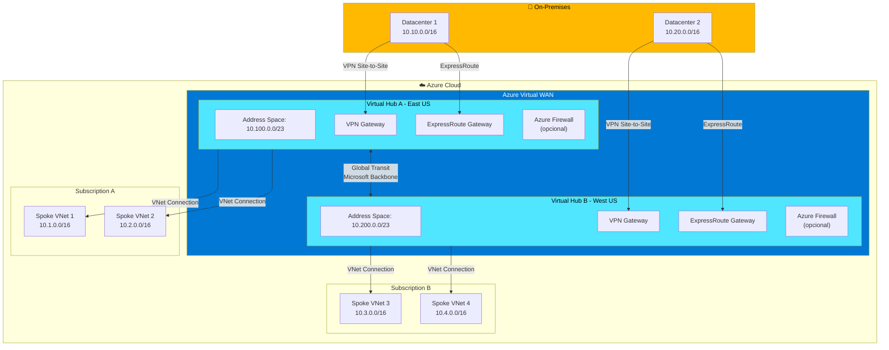
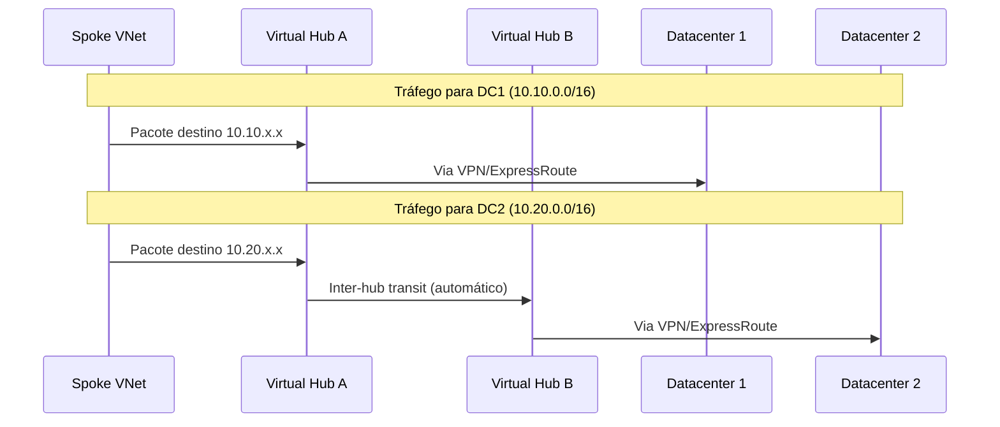
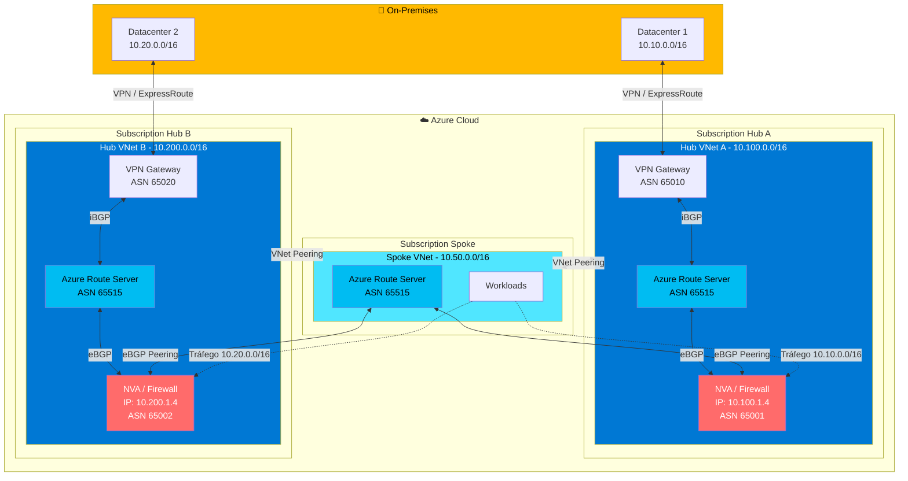
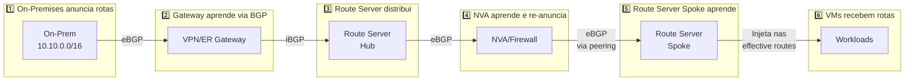
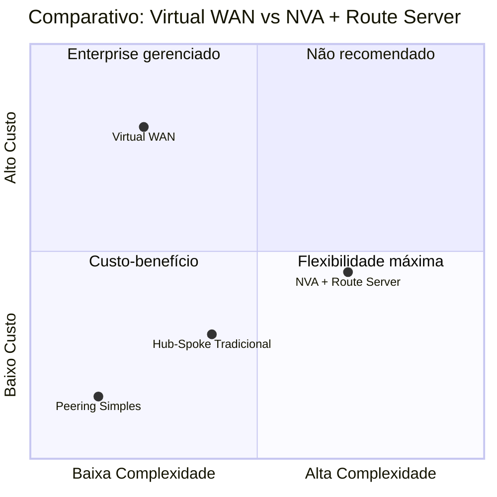

# Azure Multi-Hub Spoke Connectivity

## Cenário

Uma VNet **Spoke** precisa se conectar a **dois Hubs** em subscrições diferentes, cada um com seu próprio gateway (VPN ou ExpressRoute), e rotear o tráfego para o Hub correto conforme o destino.

### ⚠️ Limitação do VNet Peering Nativo

A opção **"Use Remote Gateways"** só pode ser habilitada em **um único peering por VNet**. Isso significa que uma Spoke não consegue usar nativamente os gateways de dois Hubs simultaneamente via peering tradicional.

---

## Opção 1: Azure Virtual WAN

### Visão Geral

O **Azure Virtual WAN** é uma solução gerenciada pela Microsoft que fornece conectividade transitiva global entre hubs, spokes, VPNs e ExpressRoute de forma nativa. Todos os hubs são conectados em full mesh automaticamente via backbone da Microsoft.

### Diagrama de Arquitetura

### Fluxo de Tráfego

### Componentes Necessários

| Componente | Descrição | SKU Recomendado |
|------------|-----------|-----------------|
| Virtual WAN | Recurso pai que agrupa os hubs | **Standard** |
| Virtual Hub | Hub gerenciado por região | /23 address space mínimo |
| VPN Gateway | Gateway S2S no hub | Scale Units conforme throughput |
| ExpressRoute Gateway | Gateway ER no hub | Scale Units conforme throughput |
| Azure Firewall | Inspeção de tráfego (opcional) | Premium |

### Configuração no Portal Azure

#### Passo 1: Criar Virtual WAN
1. Portal Azure → **Create a resource** → **Virtual WAN**
2. Configurar:
   - Nome: `vwan-global`
   - Tipo: **Standard** (necessário para multi-hub)
   - Resource Group e Região

#### Passo 2: Criar Virtual Hubs
1. Dentro do Virtual WAN → **Hubs** → **+ New Hub**
2. Para cada Hub configurar:
   - Região (ex: East US, West US)
   - Address space: `/23` (mínimo recomendado)
   - Virtual hub capacity: conforme necessidade

#### Passo 3: Adicionar Gateways aos Hubs
1. Dentro de cada Hub:
   - **VPN (Site to site)** → Criar gateway
   - **ExpressRoute** → Criar gateway
2. Configurar scale units conforme throughput necessário

#### Passo 4: Conectar VNets aos Hubs
1. Virtual WAN → **Virtual network connections** → **+ Add connection**
2. Configurar:
   - Connection name
   - Hubs: selecionar o hub apropriado
   - Subscription: pode ser diferente
   - Virtual network: selecionar a Spoke
   - Propagate to none: No
   - Associate Route Table: Default

#### Passo 5: Configurar Sites VPN / ExpressRoute
1. **VPN Sites** → adicionar sites on-premises
2. **ExpressRoute circuits** → conectar circuitos existentes
3. O roteamento entre hubs é **automático**

### Vantagens

| ✅ Vantagem | Descrição |
|-------------|-----------|
| Conectividade transitiva nativa | Todos os hubs e spokes se comunicam automaticamente |
| Roteamento automático | Não precisa de UDRs manuais |
| Full mesh entre hubs | Via backbone Microsoft |
| Escalabilidade gerenciada | Microsoft gerencia a infraestrutura |
| Integração Azure Firewall | Routing Intent para inspeção centralizada |
| Cross-subscription nativo | Conecta VNets de qualquer subscription |

### Desvantagens

| ❌ Desvantagem | Descrição |
|----------------|-----------|
| Custo elevado | Mais caro que hub-spoke tradicional |
| Menos flexibilidade | Customizações avançadas limitadas |
| Migração complexa | Se já existir infraestrutura tradicional |
| Vendor lock-in | Solução exclusiva Azure |

---

## Opção 2: NVA com Azure Route Server

### Visão Geral

Usar **Network Virtual Appliances (NVAs)** com **Azure Route Server** permite injetar rotas dinamicamente via BGP, eliminando a necessidade de UDRs manuais. O Route Server aprende rotas dos NVAs e as propaga automaticamente para as VMs.

### Diagrama de Arquitetura

### Fluxo de Propagação de Rotas BGP

### Componentes Necessários

| Componente | Localização | Função | Subnet Necessária |
|------------|-------------|--------|-------------------|
| Azure Route Server | Hub A | Troca rotas BGP com NVA e Gateway | RouteServerSubnet (/24) |
| Azure Route Server | Hub B | Troca rotas BGP com NVA e Gateway | RouteServerSubnet (/24) |
| Azure Route Server | Spoke | Recebe rotas dos NVAs | RouteServerSubnet (/24) |
| NVA/Firewall | Hub A | Next-hop para DC1, faz peering BGP | Subnet dedicada |
| NVA/Firewall | Hub B | Next-hop para DC2, faz peering BGP | Subnet dedicada |
| VPN/ER Gateway | Hub A | Conectividade on-premises | GatewaySubnet (/27) |
| VPN/ER Gateway | Hub B | Conectividade on-premises | GatewaySubnet (/27) |

### Configuração no Portal Azure

#### Passo 1: Preparar Subnets

Em cada VNet (Hub A, Hub B, Spoke), criar:

| Subnet | CIDR | Observação |
|--------|------|------------|
| RouteServerSubnet | /24 ou /25 | Nome exato obrigatório |
| GatewaySubnet | /27 | Apenas nos Hubs |
| NVA-Subnet | /28 ou maior | Apenas nos Hubs |

#### Passo 2: Criar Route Servers

1. Portal Azure → **Create a resource** → **Route Server**
2. Para cada Route Server (Hub A, Hub B, Spoke):
   - Selecionar a VNet correspondente
   - Selecionar a RouteServerSubnet
   - Criar IP público (Standard SKU)
3. Após criação, habilitar **Branch-to-branch**: Yes

#### Passo 3: Configurar VNet Peering

**⚠️ IMPORTANTE: NÃO habilitar "Use Remote Gateways"**

| Configuração | Spoke → Hub | Hub → Spoke |
|--------------|-------------|-------------|
| Allow virtual network access | ✅ Enabled | ✅ Enabled |
| Allow forwarded traffic | ✅ Enabled | ✅ Enabled |
| Allow gateway transit | ❌ Disabled | ❌ Disabled |
| Use remote gateways | ❌ Disabled | N/A |

Repetir para ambos os Hubs (A e B).

#### Passo 4: Configurar BGP Peering nos Route Servers

**No Route Server do Hub A:**
1. Route Server → **Peers** → **+ Add**
2. Adicionar peering com o NVA local:
   - Peer name: `nva-hub-a`
   - Peer ASN: `65001` (ASN do NVA)
   - Peer IP: `10.100.1.4` (IP do NVA)

**No Route Server do Hub B:**
- Mesmo processo com NVA do Hub B (ASN 65002)

**No Route Server da Spoke:**
1. Adicionar peering com NVA do Hub A:
   - Peer ASN: `65001`
   - Peer IP: `10.100.1.4`
2. Adicionar peering com NVA do Hub B:
   - Peer ASN: `65002`
   - Peer IP: `10.200.1.4`

#### Passo 5: Configurar NVAs

Os NVAs precisam ser configurados para:

1. **Estabelecer BGP** com os Route Servers:
   - Peer com Route Server local (2 IPs - HA)
   - Peer com Route Server da Spoke (2 IPs - HA)

2. **Anunciar rotas** apropriadas:
   - NVA Hub A anuncia: `10.10.0.0/16` (DC1)
   - NVA Hub B anuncia: `10.20.0.0/16` (DC2)

3. **Configurar AS-Path** para controle de preferência

#### Passo 6: Verificar Rotas Aprendidas

Na Spoke, verificar effective routes das VMs:
1. VM → **Networking** → **Effective routes**
2. Deve mostrar:

| Prefixo | Next Hop Type | Next Hop | Source |
|---------|---------------|----------|--------|
| 10.10.0.0/16 | Virtual Appliance | 10.100.1.4 | Route Server |
| 10.20.0.0/16 | Virtual Appliance | 10.200.1.4 | Route Server |
| 10.100.0.0/16 | VNet peering | - | System |
| 10.200.0.0/16 | VNet peering | - | System |

### Requisitos do NVA para BGP

| Requisito | Descrição |
|-----------|-----------|
| Suporte BGP | Deve suportar eBGP (maioria dos firewalls enterprise) |
| Multi-hop BGP | Route Server usa eBGP multi-hop |
| ASN único | Cada NVA precisa de ASN diferente do 65515 (reservado) |
| IP Forwarding | Habilitar na NIC do NVA |
| AS Override | Necessário em cenários multi-região |

### NVAs Compatíveis

- Azure Firewall (via Route Server integration)
- Palo Alto Networks
- Fortinet FortiGate
- Cisco CSR/FTD
- Check Point
- Barracuda
- Qualquer appliance com suporte BGP

### Vantagens

| ✅ Vantagem | Descrição |
|-------------|-----------|
| Roteamento dinâmico | BGP elimina UDRs manuais |
| Flexibilidade | Usa qualquer NVA do mercado |
| Failover automático | BGP detecta falhas e reconverge |
| Menor custo | Mais barato que Virtual WAN |
| Controle granular | Políticas BGP customizáveis |
| Infraestrutura existente | Aproveita firewalls já licenciados |

### Desvantagens

| ❌ Desvantagem | Descrição |
|----------------|-----------|
| Complexidade | Requer conhecimento de BGP |
| Gestão de NVAs | Updates, HA, monitoramento |
| Route Server custo | ~$365/mês por instância |
| Troubleshooting | Mais difícil que Virtual WAN |

---

## Comparativo Final

### Tabela Comparativa

| Critério | Virtual WAN | NVA + Route Server |
|----------|-------------|-------------------|
| **Complexidade de Setup** | 🟢 Baixa | 🟡 Média-Alta |
| **Complexidade Operacional** | 🟢 Baixa | 🟡 Média |
| **Custo Mensal** | 🔴 Alto | 🟡 Médio |
| **Flexibilidade** | 🟡 Média | 🟢 Alta |
| **Roteamento** | Automático | BGP dinâmico |
| **Failover** | Nativo | Via BGP |
| **Escalabilidade** | Gerenciada MS | Manual |
| **Multi-região** | 🟢 Nativo | 🟡 Requer config |
| **Inspeção de tráfego** | Azure Firewall | Qualquer NVA |
| **Migração de existente** | 🟡 Complexa | 🟢 Incremental |
| **Suporte Microsoft** | 🟢 Completo | 🟡 Parcial (NVA é vendor) |

---

## Recomendação por Cenário

### 🏢 Use **Virtual WAN** quando:

- ✅ Projeto **greenfield** (começando do zero)
- ✅ Precisa de **simplicidade operacional**
- ✅ Tem **budget** disponível
- ✅ Quer **suporte unificado** Microsoft
- ✅ Múltiplas regiões com **requisito de full mesh**
- ✅ Equipe com **pouca experiência** em roteamento avançado

### 🔧 Use **NVA + Route Server** quando:

- ✅ Já possui **NVAs/Firewalls licenciados**
- ✅ Precisa de **controle granular** sobre roteamento
- ✅ Quer **otimizar custos**
- ✅ Tem **expertise em BGP** na equipe
- ✅ Cenário **brownfield** (infraestrutura existente)
- ✅ Requisitos específicos de **compliance** com vendor específico

---

## Estimativa de Custos (Referência USD)

### Virtual WAN

| Recurso | Custo/hora | Custo/mês (estimado) |
|---------|------------|---------------------|
| Virtual WAN Standard | $0.05/hub | ~$36/hub |
| VPN Gateway (1 SU) | $0.361 | ~$263 |
| ExpressRoute GW (1 SU) | $0.42 | ~$306 |
| Hub Data Processing | $0.02/GB | Variável |
| **Total mínimo (2 hubs)** | - | **~$1.200+** |

### NVA + Route Server

| Recurso | Custo/hora | Custo/mês (estimado) |
|---------|------------|---------------------|
| Route Server | $0.50 | ~$365 |
| VPN Gateway VpnGw1 | $0.19 | ~$138 |
| NVA (varia por vendor) | - | $200-$1000+ |
| **Total mínimo (3 RS + 2 GW)** | - | **~$800+** |

*Valores aproximados, consulte a calculadora Azure para valores atuais.*

---

## Referências

- [Azure Virtual WAN Overview](https://learn.microsoft.com/en-us/azure/virtual-wan/virtual-wan-about)
- [Hub-Spoke with Virtual WAN Architecture](https://learn.microsoft.com/en-us/azure/architecture/networking/architecture/hub-spoke-virtual-wan-architecture)
- [Azure Route Server Overview](https://learn.microsoft.com/en-us/azure/route-server/overview)
- [Route Injection in Spokes](https://learn.microsoft.com/en-us/azure/route-server/route-injection-in-spokes)
- [Multi-Hub Spoke with Azure Firewall](https://learn.microsoft.com/en-us/azure/firewall/firewall-multi-hub-spoke)
- [VPN Gateway Transit Configuration](https://learn.microsoft.com/en-us/azure/vpn-gateway/vpn-gateway-peering-gateway-transit)
- [Multi-region Networking with Route Server](https://learn.microsoft.com/en-us/azure/route-server/multiregion)
- [Virtual WAN Routing Policies](https://learn.microsoft.com/en-us/azure/virtual-wan/how-to-routing-policies)
